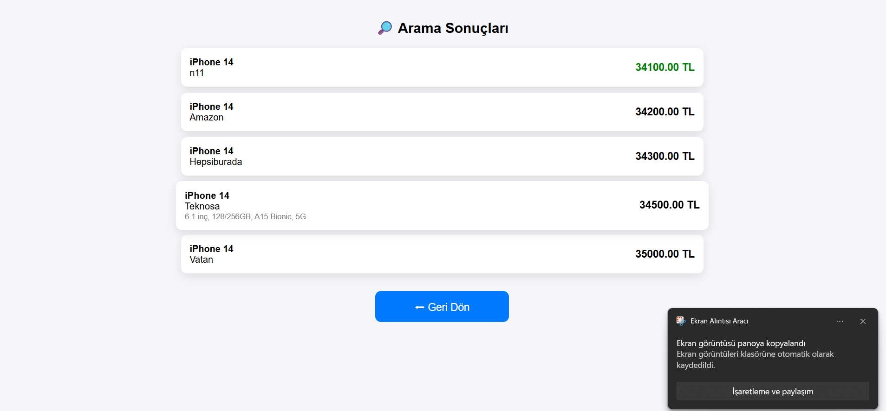

# 📱 Dinamik Fiyat Karşılaştırma Sistemi

Modern arayüze sahip PHP & MySQL tabanlı dinamik fiyat karşılaştırma web uygulaması.

Kullanıcılar ürün seçerek farklı mağazalardaki fiyatları listeleyebilir ve en uygun fiyatı kolayca görebilir.

---

# 🚀 Proje Özellikleri

✅ Dinamik ürün arama sistemi <br></br>
✅ Mağazalara göre fiyat karşılaştırma<br></br>
✅ En ucuz fiyatı otomatik yeşil gösterme<br></br>
✅ Responsive ve modern tasarım<br></br>
✅ PHP & MySQL veritabanı bağlantısı<br></br>
✅ Kullanıcı dostu arayüz<br></br>

---

# 🛠️ Kullanılan Teknolojiler

* HTML
* CSS
* PHP
* MySQL

---

# 📸 Proje Görselleri

## 🔍 Ana Sayfa

Kullanıcı ürün seçerek fiyat karşılaştırması yapabilir.


---

## 📊 Fiyat Karşılaştırma Sonuçları

Seçilen ürünün farklı mağazalardaki fiyatları listelenir ve en uygun fiyat yeşil renkle gösterilir.



---

# 📂 Proje Yapısı

```bash
fiyat_sitesi/
│
├── index.html
├── sonuc.php
├── baglanti.php
├── images/
│   ├── anasayfa.png
│   └── sonuc.png
└── README.md
```

---


# ▶️ Projeyi Çalıştırma

Tarayıcıdan aç:

```bash
http://localhost/fiyat_sitesi/
```

---

# 🎯 Proje Amacı

Bu proje;

* PHP backend mantığını öğrenmek
* MySQL veritabanı işlemleri yapmak
* Dinamik web uygulaması geliştirmek
* Frontend & backend bağlantısını anlamak

amacıyla geliştirilmiştir.

---

# 👨‍💻 Geliştirici

**Mümin Tekdemir**,**Dilara Evcioğlu**,**Yasin Bekyurt**
